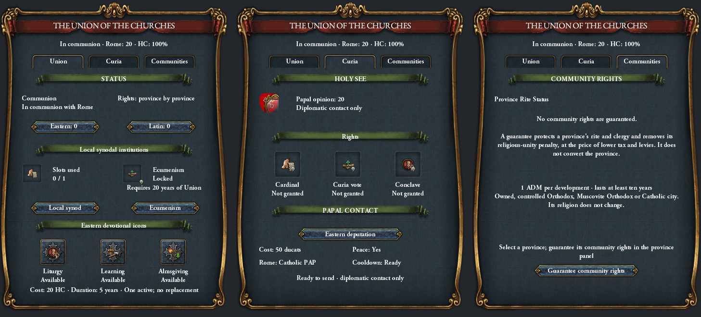

# Компонування церковного вікна — 1 жовтня 2026

Зміни зроблено за трьома скриншотами Union, Curia та Communities.
<<<<<<< HEAD
=======

Подальше уточнення: окреме `Paths to the Union` прибрано з GUI;
історичні події й рішення збережені. У Curia відновлено назву та
клікабельний герб поточного контролера. Для HC додані іконки унійного
архієпископа 38×38, лише для греко-католиків; православні іконки
не замінено. Джерело, DDS та промпт: `gfx/interface/rip_church/`.
Нові прив’язки, розміри DDS, православний fallback і відсутність
постійної панелі перевіряються контрактами GUI. Прев’ю оновлено,
внутрішньоігровий рендер цього уточнення ще не перевірено.

>>>>>>> 82216ded (feat(gc_church): Переробити графічний інтерфейс та оновити механіки греко-католицької церкви)
Активний `dlc_load.json` містить `mod/RIP.mod`; дескриптор посилається
на робочу папку RIP, а не на Workshop-копію.

## Зміни

- Єдина рамка 475×660: штатна `choose_idea_bg.dds`, cornered tile з
  незмінними кутами 32×64. Фон без намальованих внутрішніх карток.
- Прозорі дочірні групи; видалено всі чорні `small_tiles_dialog` із цих вкладок.
- Спільний заголовок, статус і три вкладки на однакових координатах.
- Основний шрифт `vic_18`, як у ванільній панелі Religion; заголовок `vic_22`.
- Кнопки інституцій вирівняні по одній горизонталі; текст станів і вимог
  має окремі області. Скорочені видимі лічильники Eastern / Latin.
- Заголовок HC підключено як scripted text замість необчисленого
  `[Root.GetChurchAuthorityHeading]`; збережено православний fallback.
- Виправлені конфлікти злиття в генераторі локалізації. Числа механік не змінювались.

## Докази

- `build_church_gui.py --check`, `build_church_localisation.py --check`: синхронно.
- `check_church_gui_routes.py`: 13 контрактів пройдено.
- `check_gc_curia_window.py`, `check_church_redesign.py`, `check_gc_pa_pacing.py`,
  `check_clausewitz_braces.py`, `check_glossary.py`: пройдено.
- `preview_church_tabs.py`: використовує наявні текстури та bitmap-метрики
  шрифтів установленої EU4; перевіряє межі панелі, перетини текстових областей
  і підписаних кнопок та варіанти безпосередньо використаних readout.
- Загальна `check_script_layer.py`: на момент запуску 4 помилки та 292
  попередження. Помилки — дублікати `hlc_the_boyars_take_power_*` і
  `hlc_elevate_the_metropolitan_*` у галицькій локалізації, поза GUI-зміною.

Прев’ю — відтворення вихідного макета з прикладовими значеннями, не скриншот
гри. Воно не моделює рушійні кольори, disabled/hover-стани й маскування герба
точно. Поточну сесію EU4 не перезапускали. Внутрішньоігрові кліки, tooltip,
оновлення scripted text та масштабування екрана потребують перевірки після
повного перезапуску гри.

Для повторення: Python із Pillow, `python -B tools/preview_church_tabs.py`.
