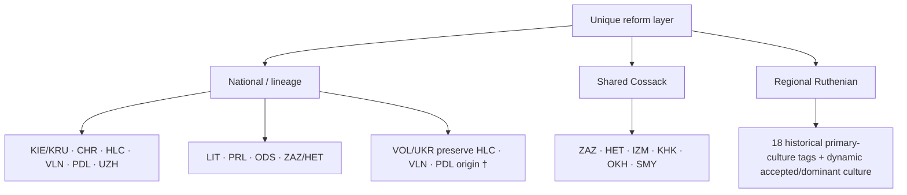
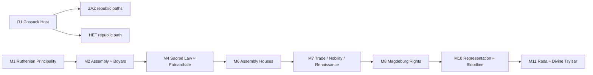
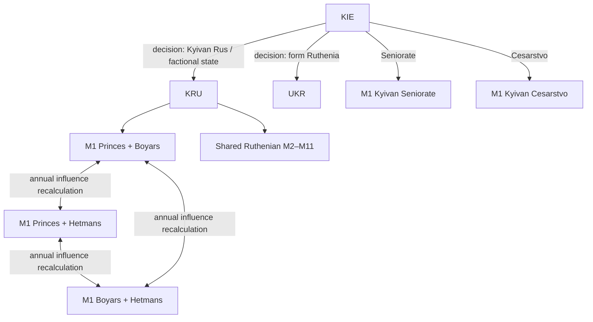
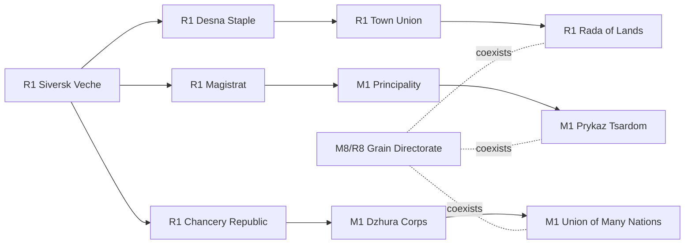
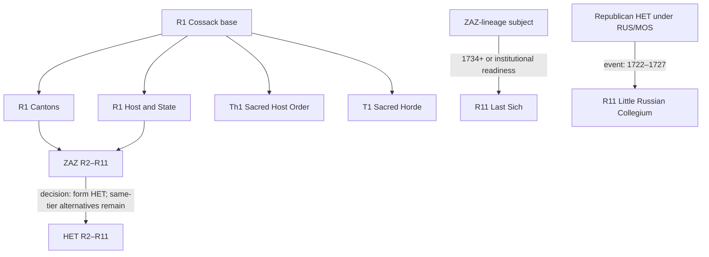
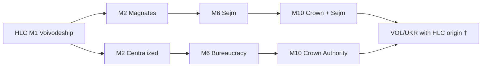
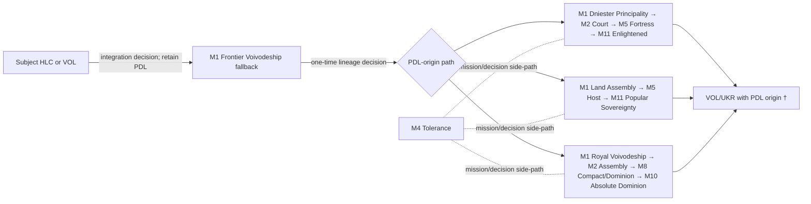
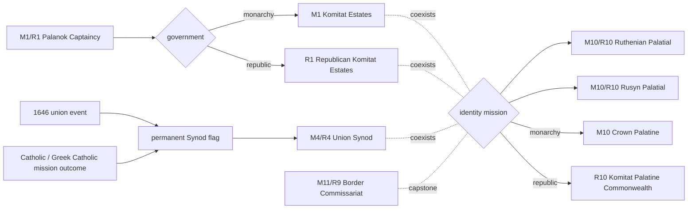
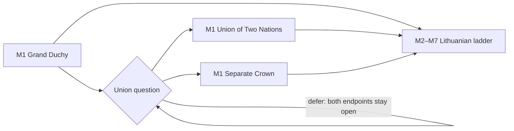
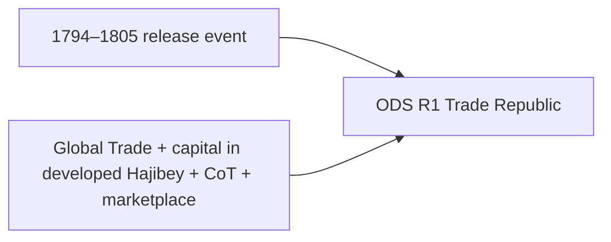

# Карта унікальних урядових реформ RIP

Актуально для EU4 **1.37.5**. Карта описує фактичну реєстрацію у
`common/governments/00_governments.txt`, а не лише місце визначення реформи.

## Легенда

- `M1–M11` — тіри монархії;
- `R0–R13` — базова реформа і тіри республіки;
- `Th1` — перший тір теократії;
- `T1` — перший тір племінного уряду;
- `A ≈ B` — взаємовиключні реформи одного тіру;
- `A → B` — розвиток системи або перехід між формами; коли перехід виконує
  скрипт, стрілка має підпис `decision`, `event` чи `mission`;
- `†` — реформа зберігає доступ після зміни тегу через self/origin gate;
- `regional` — доступ визначає руська культура, а не конкретний тег.
- `Kyivan` — потрібна київська попередня реформа; `predecessor` — потрібна
  конкретна попередня реформа тієї самої гілки; `global` — немає національного
  або культурного обмеження.

## Огляд тегів

| Тег або lineage | Унікальна система | Основні переходи |
|---|---|---|
| `KIE`, `KRU` | шість базових форм і спільна руська драбина | `KIE → KRU` через рішення; `KIE` також може утворити `UKR`; три factional-форми автоматично змінюються за впливом станів |
| `CHR` | три дороги Сіверського віча та Зернова дирекція | дві дороги переходять у монархію; Дирекція доступна і монархії, і республіці |
| `HLC` | польський та австрійський конституційні шляхи | `HLC → VOL†/UKR†` зберігає HLC-lineage |
| `VLN` | волинська станово-конфесійна драбина | `VLN → VOL†/UKR†`; міські інститути відкриті всьому руському культурному регіону |
| `PDL` | дністровсько-кам’янецький, прикордонно-козацький і магнатський шляхи | `PDL → VOL†/UKR†`; стандартне формування Ruthenia відбувається через `UKR`, не `RUS` |
| `VOL` | носій успадкованої HLC/VLN/PDL-системи та західноруських місій | продовжує origin-гілку попередника й може перейти до `UKR` без втрати культурної драбини |
| `UZH` | Паланок, комітат, Ужгородська унія та три ідентичності | частина реформ має еквіваленти у монархії й республіці |
| `LIT` | Велике князівство, рада, канцелярія, сейм і Статут | союзна корона `≈` окрема корона; відкладення питання не закриває обидва фінали |
| `PRL` | давня князівська та полкова республіканська гілки | місія відкриває перехід у республіку; `PRL → HET` нормалізує уряд |
| `ODS` | Одеська торгова республіка | історичний release 1794–1805 або вільний порт Хаджибея після Global Trade |
| `ZAZ` | чотири базові дороги та пізня січова драбина | республіканський `ZAZ → HET`; Sacred Order/Horde лишаються окремими фіналами |
| `HET` | старшинська, полкова, академічна та залежна колегіальна драбина | рішення ставлять flags для полкової й академічної реформ; Колегію накладає окрема подія |

`IZM`, `KHK`, `OKH` і `SMY` стартують зі спільною козацькою реформою, але не
мають власної національної драбини. Держави з руською або русинською первинною,
прийнятою чи домінантною культурою бачать майже всю спільну руську драбину.
Винятки позначено як `Kyivan` або `predecessor`. Це дозволяє регіональній
державі розвивати інститути без обов’язкового існування окремого тегу.

### Повне покриття тегів

| Категорія | Теги |
|---|---|
| Власна national/lineage-система | `KIE`, `KRU`, `CHR`, `HLC`, `VLN`, `PDL`, `UZH`, `LIT`, `PRL`, `ODS`, `ZAZ`, `HET` |
| Спільний козацький старт без окремої драбини | `IZM`, `KHK`, `OKH`, `SMY` |
| Formable-носії успадкованої системи | `VOL`, `UKR` |
| Теги з руською/русинською primary culture у country history | `HET`, `HLC`, `IZM`, `KHK`, `KIE`, `KRU`, `KUY`, `ODS`, `OKH`, `PDL`, `PRL`, `RPS`, `SMY`, `TRV`, `UZH`, `VLN`, `VOL`, `ZAZ` |

Останній рядок не є жорстким whitelist: культурний gate також реагує на
accepted/dominant culture, тому в ході кампанії до регіональної драбини може
долучитися інший тег.

## Спільні руські та козацькі реформи

| Тір | Реформи |
|---|---|
| `R0 global` | `rip_republic_mechanic` — сумісний зі старими saves namespaced-аналог ванільної базової республіки |
| `R1` | `rip_cossacks_reform` — спільна козацька база без спалення провінцій |
| `M1 regional` | `ruthenian_principality_reform`; `principality_appanage` створюється спеціальним appanage-ефектом |
| `M2` | `elected_assemblies_reform` (`Kyivan`) ≈ `boyar_elite_reform` (`regional`) |
| `M4 regional` | `sacred_regulation_reform` ≈ `patriarch_engagement_reform` |
| `M6 regional` | `assembly_houses_reform` |
| `M7 regional` | `open_trading_ports_reform` ≈ `merchant_nobility_reform`; `vln_ruthenian_renaissance_reform` |
| `M8 regional` | `vln_magdeburg_rights`, з окремими міськими та інституційними умовами |
| `M10` | `representation_monarchy_reform` (`Kyivan` + Boyar Elite) ≈ `considerable_bloodline_reform` (`regional`) |
| `M11` | `legislative_rada_reform` (`regional`) ≈ `divine_tsyisar_reform` (`predecessor`) |

`ruthenian_principality_reform` більше не накладає на стартовий KIE 25% мінімальної
автономії: її окрема ігрова роль — дешевше керування землями, данина та нижче
бажання свободи від розвитку удільних князівств. На M2 Veche Assemblies дає
територіальне представництво й швидший прогрес реформ ціною `max_absolutism -10`,
тоді як Boyar Rada лишається військово-шляхетською альтернативою. Благословення
патріарха доступне лише православній, російській православній або
греко-католицькій державі, тобто вірі з реальною шкалою Patriarch Authority.

## KIE / KRU

Усі шість національних форм стоять на `M1`:

- `kyivan_rus_reform`;
- `kyivan_shogunate_reform` — локалізований як Kyivan Seniorate;
- `kyivan_cesarstvo_reform`;
- `ruthenian_factional_empire_reform`;
- `ruthenian_factional_empire_princes_hetmans_reform`;
- `ruthenian_factional_empire_boyars_hetmans_reform`.

Середньовічні KIE/KRU-форми більше не відкривають козацький UI. Постійні
бонуси належать реформам; рішення Seniorate/Cesarstvo дають лише двадцятирічну
інавгураційну нагороду.

Загальне рішення утворення `UKR` доступне не лише київській лінії, а будь-якій
допустимій державі з руською primary culture. Для прямого переходу
`HLC/VLN/PDL → UKR` origin-flag ставиться до `change_tag`, тому національна
західноруська гілка не зникає. Якщо HLC-origin держава утворила `UKR` до
виконання волинської місії, вибір польського або австрійського шляху
відкривається подією одразу після зміни тегу, а не втрачається разом із місією.

## CHR

| Тір | Реформи |
|---|---|
| `R1` | `siversk_veche_reform`; дорога міст: `chr_desna_staple_reform` → `chr_town_union_reform` → `chr_rada_of_lands_reform`; початки інших доріг: `chr_magistrat_rule_reform`, `chr_kanceliaryst_republic_reform` |
| `M1` | `chr_siversk_principality_reform` → `chr_prykaz_tsardom_reform`; `chr_dzhura_corps_reform` → `chr_many_nations_union_reform` |
| `M8/R8` | `chr_grain_directorate_reform` — економічна надбудова для всіх трьох доріг |

Нагороди незалежності та flavour-подій використовують ванільний
`legitimacy_equivalent`, отже торгове віче не отримує порожню легітимність;
проголошення Great Chernihiv не понижує вже наявний імперський ранг.

## ZAZ / HET

| Тір | ZAZ | HET |
|---|---|---|
| base | `R1` `zaz_cossack_cantons_reform` ≈ `zaz_host_and_state_reform`; `Th1` `zaz_sacred_host_order_reform`; `T1` `zaz_sacred_horde_reform` | `R1` `rip_cossacks_reform` для республіканського маршруту |
| `R2` | `zaz_sich_brotherhood_reform` | `het_starshyna_oligarchy_reform` |
| `R3` | `zaz_kosh_elections_reform` | `het_hetman_for_life_reform` |
| `R6` | `zaz_general_rada_reform` | `het_academy_enlightenment_reform` |
| `R7` | — | `het_regimental_system_reform` |
| `R8` | `zaz_chaiky_trade_reform` | — |
| `R10` | `zaz_free_host_reform` | `het_mazepist_autocracy_reform` (Baturyn Hetman's Court) |
| `R11` | `zaz_last_sich_reform` | `het_collegium_control_reform` |

Первинне прийняття `Last Sich` обмежене залежною державою ZAZ-lineage; уже
прийнята реформа self-gate зберігається після здобуття незалежності. Вона не
використовує французькі революційні фракції. `Little Russian Collegium` не є
добровільною звичайною реформою: її накладає історично обмежена подія.
Полкова адміністрація додає власний прихований
`het_regimental_province_administration`; вона більше не конфліктує з
османським pasha-модифікатором і синхронізується при зміні власника провінції.
Формування HET доступне лише PRL або республіканському ZAZ: Sacred Host Order і
Sacred Horde завершують власні теократичну та племінну фантазії. Рішення, що
встановлюють HET-реформи R6/R7 або змінюють вибори, додатково вимагають
республіканського уряду. Старий HET із сакральною реформою на startup повертається
до ZAZ, якщо тег вільний; якщо інший ZAZ уже існує, він одноразово переходить до
республіканської козацької бази без створення дубліката країни.
Startup-міграція замінює старий ключ у наявних HET-збереженнях, не торкаючись
справжніх османських пашаликів.

## HLC та успадкування у VOL/UKR

| Тір | Польський шлях | Австрійський шлях | Спільне |
|---|---|---|---|
| `M1` | — | — | `hlc_galician_voivodeship_reform` |
| `M2` | `hlc_magnate_assembly_reform` | `hlc_centralized_voivodeship_reform` | прямий взаємовиключний вибір |
| `M4` | — | — | `hlc_confessional_dualism_reform` |
| `M5` | — | `hlc_military_modernization_reform` | — |
| `M6` | `hlc_galician_sejm_reform` | `hlc_austrian_bureaucracy_reform` | прямий взаємовиключний вибір |
| `M8` | `hlc_merchant_privileges_reform` | — | — |
| `M10` | `hlc_crown_and_sejm_reform` | `hlc_crown_authority_reform` | прямий взаємовиключний вибір |
| `M11` | — | — | `hlc_enlightened_monarchy_reform` |

Польська M2-гілка навмисно вмикає ванільну систему польських виборів: це
конституційний зв’язок із Річчю Посполитою, а не випадковий імпорт чужого UI.
Власні HLC-бонуси при цьому лишаються видимими без прихованих дублюючих
модифікаторів.

## VLN та регіональні інститути

| Тір | Реформа |
|---|---|
| `M1` | `vln_voivodeship_reform` |
| `M2` | `vln_cossack_host_reform` |
| `M3` | `vln_confessional_academy` |
| `M4` | `vln_confessional_reform` |
| `M5` | `vln_black_voivode_legion` — локалізований як Volhynian Court Regiment |
| `M6` | `vln_voivode_council` |
| `M7 regional` | `vln_ruthenian_renaissance_reform` |
| `M8 regional` | `vln_magdeburg_rights` |
| `M9` | `vln_ruthenia_reform` |
| `M10` | `vln_grand_ruthenia_reform`, лише після `rip_vol_grand_ruthenia` |

`VLN → VOL†/UKR†` зберігає волинський lineage. `VLN` тепер стартує з
`vln_voivodeship_reform`, а startup-reconciliation виправляє старі saves.
Renaissance і Magdeburg Rights
винесені до спільного руського файла: їх можуть прийняти інші руські держави,
якщо вони виконують культурні, інституційні та міські умови.
`vln_cossack_host_reform` використовує одну тематичну систему — Cossacks — без
паралельного прусського Militarization UI; військові привілеї натомість знижують
`max_absolutism` на 10.

## PDL

| Тір | Дністровсько-кам’янецький | Прикордонно-козацький | Магнатський | Загальний/fallback |
|---|---|---|---|---|
| `M1` | `pdl_steppe_principality_reform` (Dniester Principality) | `pdl_clan_assembly_reform` (Podillian Land Assembly) | `pdl_voivodeship_kingdom_reform` (Royal Voivodeship) | `pdl_frontier_voivodeship_reform` до вибору шляху |
| `M2` | `pdl_palatine_court_reform` | — | `pdl_aristocratic_assembly_reform` | — |
| `M4` | — | — | — | `pdl_religious_tolerance_reform`, після tolerance-path |
| `M5` | `pdl_carpathian_bastion_reform` | `pdl_frontier_republic_reform` | — | — |
| `M8` | — | — | `pdl_magnate_republic_reform` ≈ `pdl_magnate_dominion_reform` | — |
| `M10` | — | — | `pdl_absolute_dominion_reform` | `pdl_grand_podillia_reform`, після місії |
| `M11` | `pdl_enlightened_voivodeship_reform` | `pdl_revolutionary_republic_reform` (Popular Sovereignty) | — | — |

Назви `Podillian Land Assembly`, `Dniester Principality` і `Kamianets Fortress
System` замінили степові клани та «карпатську» географію, які не відповідали
Поділлю. Псевдореспубліканські internal ID збережені для saves, але видимі
назви прямо пояснюють, що це конституційні форми монархії. Нова кампанія
починається з fallback-воєводства; рішення шляху одразу замінює M1-реформу.
Startup-ефект робить таку саму звірку для старих збережень. Дипломатичні унії
з підлеглими HLC або VOL інтегрують їх, але лишають державу Поділлям: суверен
не втрачає власну конституцію через прийняття галицької присяги. Збереження,
створені старою версією помилкового переходу `PDL → HLC`, мігрують на startup:
повертаються до PDL, якщо тег вільний, або безпечно нормалізуються до HLC, якщо
інше Поділля вже існує. Якщо такий старий HLC уже встиг сформувати VOL чи UKR,
міграція відновлює PDL-origin без повторної зміни тегу або дерева місій.
Якщо PDL сформувало VOL або UKR до вибору установчого шляху, три взаємовиключні
рішення залишаються доступними саме за PDL-origin; вибраний flag назавжди ховає
решту, а позитивні AI-ваги не лишають такого нащадка на fallback-гілці.
Просвітницький та представницький фінали перенесено з раннього M7 до M11 —
ванільного монархічного тіру поділу влади, де вже стоять enlightened і
revolutionary monarchy-аналоги. Це синхронізує появу реформ з їхніми
Enlightenment/Age of Revolutions умовами, не змінюючи save-сумісні ID.

## UZH

| Тір | Реформа |
|---|---|
| `M1/R1` | `uzh_palanok_captaincy_reform` |
| `M1` | `uzh_komitat_system_reform` |
| `R1` | `uzh_republican_komitat_system_reform` |
| `M4/R4` | `uzh_union_synod_reform`, після постійно зафіксованого успіху церковної унії та не раніше 1646 року |
| `M10/R10` | `uzh_palatial_ruthenian_reform` ≈ `uzh_palatial_rusyn_reform` |
| `M10` | `uzh_palatial_uhro_reform` |
| `R10` | `uzh_palatial_uhro_republic_reform` |
| `M11/R9` | `uzh_carpathian_border_commissariat_reform` |

Palanok тепер описаний як статутна капітанія зі спільним голосом замкових
капітанів і місцевої асамблеї, а не як спадковий уряд. Uhro-Rusyn шлях не
понижує ранг країни і не імпортує прусський militarization UI. Його M10-варіант
дає легітимність, а окремий R10-варіант — республіканську традицію. Palanok
використовує власні партії `states_general_mechanic`, але не позначається як
Dutch Republic; Ruthenian Palatial є місцевим пактом руських депутатів,
прикордонної шляхти й міст та не припускає неіснуючої унії з Польщею або Литвою.
Він має звичайний парламент без англійських парламентських дій та питань.
Партії Паланка використовують лише універсальні бонуси й витрати: соймова
торгова програма послаблює бойовий запал, а капітанські мобілізації підвищують
невдоволення. Обидві мають окремі vanilla-style `*_MECHANIC_TOOLTIP`, тому UI не
показує сирі ключі. Жодна половина механіки не стає no-op у монархії чи республіці.
Перехід від Паланка до комітатів за наявності
`Res Publica` вимагає 70% підтримки Партії капітанів; без DLC умова коректно
відступає, бо самого партійного UI немає. Ця конституційна колонка підтримує
монархію й республіку; зовнішній перехід UZH у теократію приховує її замість
того, щоб силоміць додавати реформу поза теократичними тірами. Монархічний і
республіканський комітат мають окремі save-safe ID, тому R1 не успадковує
консорта, спадкоємця або династичні шлюби. Палацова місія
тепер прямо вимагає завершеного вибору ідентичності, тому її нагорода не може
мовчки завершитися без однієї з трьох реформ M10/R10.
Сам вибір більше не залежить від ще не встановленого identity-flag і не вимагає
чотирьох штучних culture conversions від однопровінційного старту: до нього
рахуються п’ять провінцій релевантних русинських, руських або угро-русинських
культур, а після вибору всі наступні умови вже перевіряють конкретний шлях.
П’ять парламентських місць і два лояльні суб’єкти рахуються ванільними
лічильниками провінцій/суб’єктів, а не `calc_true_if` з одним вкладеним scope.
Rusyn та Uhro-Rusyn identity-гілки приймають і монархію, і республіку та
нагороджують їх через ванільний `legitimacy_equivalent`; федералізація сходиться
після спільного Pannonian Compact, а не вимагає одночасно дві несумісні місії.
Її фінальна урядова нагорода також визначається поточним типом уряду, а не
старим branch-flag, тому зміна конституції не перетворює її на no-op.
Поселення в Альфельді та Банаті тепер приймають культуру обраної ідентичності,
а не завжди повертають провінції до базової `rusyn`. Постійні нагороди спільних
монархічно-республіканських гілок використовують універсальні адміністративні,
дипломатичні та станові модифікатори; урядова валюта лишилася тільки там, де
реформа справді обмежена одним типом уряду. Фінал Rusyn State дає по 150 очок
кожної влади й підвищує лише герцогство до королівства, тому не перетворює
пізню місію на надмірний бонус і не понижує вже створену імперію. Проголосити
цю суверенну державу можна тільки після виходу з підданства.
Руський шлях завершує нейтральний Ruthenian Rite Settlement: православна й
греко-католицька держава доводить 75% Patriarch Authority, католицька — 50 Papal
Influence, а вісім провінцій рахуються за фактичною державною вірою. Нагороди та
подальша подія так само розділяють Patriarch Authority і Papal Influence, тому
жодна з трьох легальних конфесій не отримує порожню валюту.
Та сама PA/Papal parity застосована до ранньої охорони карпатського обряду та
Сремської митрополії. Паланокський Security Congress вимагає шлюбної мережі від
монархії, але від республіки — дипломатичну репутацію або 70 Republican
Tradition; його patronage-подія винагороджує обидва уряди через
`legitimacy_equivalent` і більше не обіцяє неіснуючого рішення.
Угро-русинська гілка допускає два історично різні способи скласти Пожонський
компакт: угоду з живою Угорщиною або регіональний суверенітет над Пожонню та
вісьмома карпатськими провінціями. Фінальна Danubian Ascendancy приймає як
васальний/династичний зв'язок із `HUN`, так і завоювання чи успадкування Пешта,
Пожоні та п'ятнадцяти карпатських провінцій.

Успішний результат унії в події або католицькій/греко-католицькій гілці місії ставить постійний
flag. Сама подія обмежена православною, католицькою та греко-католицькою
державою, тому інші християнські конфесії не отримують синод, прив'язаний до
Риму й візантійського обряду. Після 1646 року flag назавжди тримає M4/R4 доступним; якщо результат
настає вже після цієї дати, реформа одразу додається лише монархії або
республіці. Одноденна прихована compatibility-подія переносить активні старі
модифікатори Concord/Old Rite у постійні outcome-flags. Вона також замінює у
старих республіканських saves спільні Komitat/Uhro ID на нові R-only варіанти,
навіть якщо UZH уже сформував інший тег і зберіг самопідтримувану реформу.

## LIT

| Тір | Реформа |
|---|---|
| `M1` | `grand_duchy_reform`; фінал суперечки: `lit_union_of_two_nations_reform` ≈ `lit_separate_crown_reform` |
| `M2` | `lit_pany_rada_reform` |
| `M3` | `lit_ruthenian_chancery_reform` |
| `M4` | `lit_confessional_guarantee_reform` |
| `M5` | `lit_boyar_levy_reform` |
| `M6` | `lit_grand_diet_reform` |
| `M7` | `lit_statute_reform` |

`grand_duchy_reform` є навмисним version-sensitive override ванільного ID і
має повторно звірятися після зміни підтримуваної версії EU4.

## PRL / ODS

### PRL

| Тір | Реформа |
|---|---|
| `M1` | `prl_ancient_principality_reform` |
| `R1` | `prl_regimental_republic_reform`, після місії та окремого конституційного рішення |
| `M4` | `prl_episcopal_authority_reform` |
| `M5` | `prl_border_fortress_reform` |
| `M7` | `prl_treaty_diplomacy_reform` |
| `M8` | `prl_chernozem_economy_reform` |

Спільні дипломатичні місії та дві події ради винагороджують монархічний і
республіканський шляхи через `legitimacy_equivalent`. Left-Bank Hegemony лише
підвищує герцогство до королівства й не може понизити вже створену імперію.

### ODS

`odesa_trade_republic_reform` стоїть на `R1`.

Альтернативне рішення обмежене державою з самостійною дипломатією — незалежною,
данником або учасником культурної сфери — не більш ніж із десятьма містами.
Тому велика імперія чи звичайний васал не може безкоштовно перетворитися на
міську республіку лише заради бонусів. Її торгові міста створюються сучасною
реформою `trading_city`, а не несумісним ключем legacy-системи.

## Досяжність і рідкісні механіки

| Реформа або система | Реальне джерело | Оцінка |
|---|---|---|
| `assembly_houses_reform` | культурний Ruthenian gate, `M6` | виправлена source-unreachable реформа |
| PDL/VLN base reforms | country history + startup reconciliation | доступні у новій грі й старих saves |
| `chr_grain_directorate_reform` | економічний `M8/R8` поверх будь-якої CHR-дороги | не перекривається базовим Вічем |
| `uzh_union_synod_reform` | 1646+, постійний outcome-flag від події або католицької місії; active старі modifiers мігрують за день | історичне джерело більше не зникає разом із тимчасовим modifier |
| `zaz_last_sich_reform` | залежний ZAZ-lineage; 1734+ або рання institutional readiness | навмисно вузька пізня альтернатива, не лотерея для випадкового васала |
| `het_collegium_control_reform` | event 1722–1727 для республіканського HET під `RUS/MOS` | навмисно накладений зовнішній контроль, а не «корисний» добровільний вибір |
| `odesa_trade_republic_reform` | release event 1794–1805 або рішення вільного порту після Global Trade | має історичне й sandbox-джерело |
| HLC foundational path after early `UKR` | post-formation event, якщо origin є, а path ще не обрано | місійний swap більше не робить всю HLC-драбину недосяжною |
| PDL foundational path after early `VOL/UKR` | три взаємовиключні рішення за `west_ukraine_pdl_origin_country` | гілка доступна гравцю й AI навіть після раннього формування нащадка |
| PDL Enlightened/Popular finals | свіжий вибір на `M11` після Enlightenment/Age of Revolutions | пізня умова більше не захована на вже пройденому `M7` |
| HLC/VLN/PDL capstones | path/mission flags, що переживають `VOL/UKR` | винагорода за завершену lineage-гілку, а не випадковий global pick |

## Чому гілки дають різний геймплей

| Система | Відчутний вибір |
|---|---|
| Спільна руська | рада/представництво проти боярської спадковості й сакралізованої влади; міські права потребують реальних культурних та інституційних умов |
| CHR | торгова федерація міст, наказна монархія або військово-службова унія; Зернова дирекція є окремим економічним шаром |
| HLC | польська договірно-виборна модель проти централізованої канцелярської моделі; однакові тіри роблять це справжнім взаємовиключним вибором |
| PDL | фортеці й адміністрація Дністра, козацьке представництво або магнатська концентрація влади; кожен шлях замінює M1 і веде до інших тірів |
| ZAZ/HET | вільна Січ і виборність проти інституціоналізації полків, академії та гетьманського двору; залежність може відкрити драматичні, але не безкоштовні фінали |
| UZH | довготермінова виборна капітанія, комітат та три пізні ідентичності без випадкового Dutch/British/Prussian UI |
| LIT | союзна або окрема корона, після чого рада, руська канцелярія, конфесійна гарантія, сейм і Статут складаються у послідовну державну модель |
| PRL/ODS | рання князівська чи полкова конституція для Переяслава; пізня компактна чорноморська торгова республіка для альтернативної кампанії |

## Перевірені інваріанти

- 109 унікальних definition-ID; дублів немає.
- Кожен definition-ID присутній у government registration; навмисні
  багатотипові реформи — сумісні UZH-форми та CHR Grain Directorate.
- `assembly_houses_reform` більше не є source-unreachable.
- Нагороди рангу Great Chernihiv, загального Cossack Host і PRL Hegemony
  використовують ванільний exact-rank gate та не понижують імперію до королівства.
- HLC/VLN/PDL-origin зберігається після формування `VOL` і прямого формування
  `UKR`; HLC-початковий branch selector відновлюється після раннього `UKR`, а
  старі назви flags `rip_vol_origin_*` лишено для сумісності saves.
- Усі модові `change_tag`-рішення спершу міняють дерево місій, а потім
  викликають ванільний `on_change_tag_effect`, як вимагає контракт 1.37.5.
- PRL-origin формування `HET` переводить монархію у республіку; теократичний і
  племінний ZAZ-фінали не насильно переводяться у HET-драбину.
- Первинне прийняття `Last Sich` обмежене ZAZ-lineage subject, а ODS має два
  реальні джерела.
- Бонуси реформ показані без прихованих постійних дублюючих модифікаторів VLN/HLC.
- HET полковий province-layer використовує namespaced modifier і не залежить
  від vanilla Ottoman on-actions; старі saves мігрують на startup.
